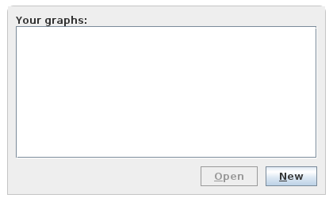
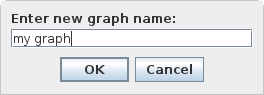
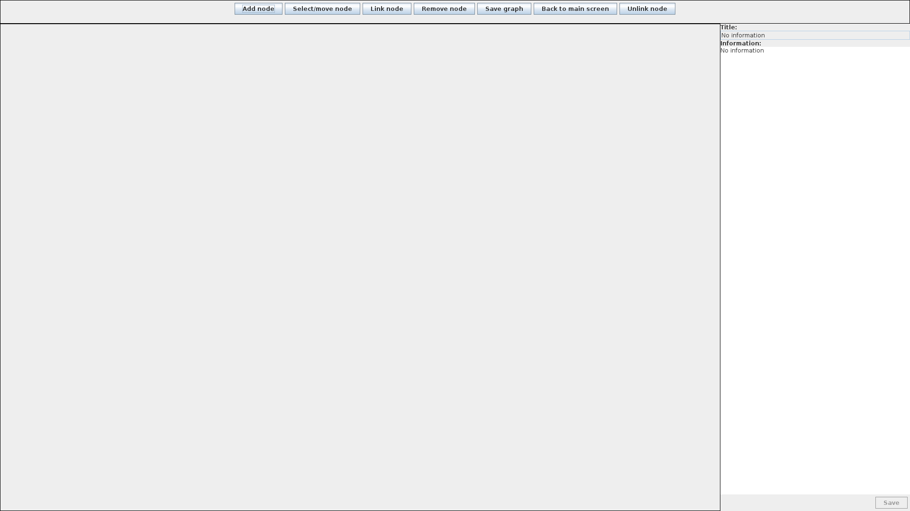
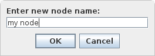
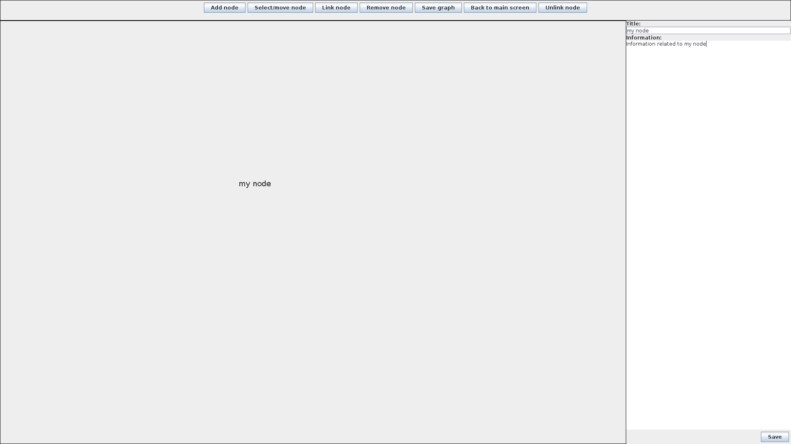

# cogito
## Presentation of the softawre
cogito is an information association visualizer. The information is encapsulated
inside a *node* that can be linked to other nodes to show a relation between the
pieces of information. The set of nodes and links forms a *graph*.

This software lets you create independent graphs and visualize them.

The data is stored locally on your device, no Internet connection required.

## How to install
### From source code
You can install the software by cloning this repository on your machine and run
`./gradlew run` while in the repository root directory.

### From installers
Two installers are provided, for Windows (a `.exe`) and Debian-based
distributions (a `.deb`). Look for them in the `Release` section.

## How to use
First we create a new graph and give it a name.




The graph editor opens with the new graph. By default the "Add node" mode is on
so a click on the graph view would create a node at that point.



There are currently five modes:

- Add node: creates new node at click point.

- Select/mode node: when a node is clicked on, its data show in the detailed
node view. If you drag a node (press a node without releasing and move the mouse
around) the node follows the mouse accordingly.

- Remove node: Deletes the node clicked on.

- Link node: Links the first node clicked on to the second node clicked on. Note
that the link is directed (currently not represented graphically).

- Unlink nodes: Unlinks the first node clicked on of the second node clicked on.
If the second node links to the first node also, that link is not affected.

Click anywere on the graphview to create a node at clicked point.



You must type a title for the node, which will appear on the graph view at
clicked point. Notice that the detailed node view was populated with the title
of the new node. You can edit the title by typing a new one and then click on
the "Save" button. Note that this DOES NOT save the node locally, in order to do
that you have to click on the "Save graph" button (the graph is automatically
saved when you go back to the main screen).



## Notes
This software is actively maintained, on a weekly basis. 

This software has been tested on Ubuntu 22.04 and nothing more. Feel free to
open an issue if something wrong happens, it is still very rudimentary.

## Development
### SonarQube
1. Launch the SonarQube server:
```
$ path/to/sonarqube/bin/<OS>/sonar.sh console
```

2. Start static analysis with Gradle task:
```
$ ./gradlew sonar \
      -Dsonar.projectKey=cogito \
      -Dsonar.projectName='cogito' \
      -Dsonar.host.url=http://localhost:9000 \
      -Dsonar.token=<TOKEN>
```

`<TOKEN>` must be replaced with the token generated with SonarQube.
